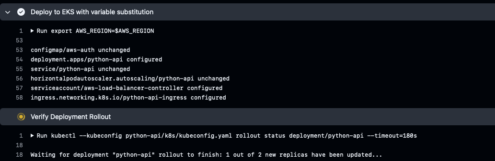
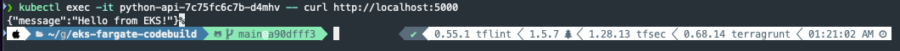
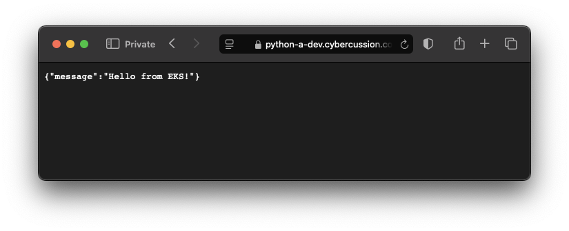

# EKS Fargate + CodeBuild GitHub Runner

This project sets up:

- An **EKS Fargate** cluster.
- A **CodeBuild-based self-hosted GitHub Actions runner**.

---

## 🐍 Python Script Wrapper for Terraform/Terragrunt

Automation is handled using a Python script to simplify running `terragrunt` commands across environments and modules.

---

## 🚀 Set Up CodeBuild Runner for GitHub Actions (CI/CD)

This creates a self-hosted GitHub Actions runner inside AWS using CodeBuild.

### ✅ Prerequisites

- A GitHub repository must be set up.
- A **CodeStar Connection** must be created to integrate GitHub with AWS.  
  If you don't have one, **stop here** and create it first.
- May need to use VPC/Private subs for Codebuild to access EKS after its created if it makes its own network.

### 🔗 GitHub Setup

1. Go to: `GitHub > Your Profile > Settings > Applications`
2. Click on **AWS Connector for GitHub**
3. Under **Repository Access**, make sure your repo is listed
4. After setup, confirm the webhook exists:  
   `GitHub > Your Repo > Settings > Webhooks`

---

## 📦 CodeBuild Runner Commands

```bash
# Initialize
python terraform/scripts/tg.py -a nonprod -e dev -f codebuild-runner -c init

# Validate
python terraform/scripts/tg.py -a nonprod -e dev -f codebuild-runner -c validate

# Plan
python terraform/scripts/tg.py -a nonprod -e dev -f codebuild-runner -c plan

# Apply
python terraform/scripts/tg.py -a nonprod -e dev -f codebuild-runner -c apply

```

## ☸️ EKS Fargate Setup Commands

```bash
# Initialize
python terraform/scripts/tg.py -a nonprod -e dev -f eks -c init

# Validate
python terraform/scripts/tg.py -a nonprod -e dev -f eks -c validate

# Plan
python terraform/scripts/tg.py -a nonprod -e dev -f eks -c plan

# Apply
python terraform/scripts/tg.py -a nonprod -e dev -f eks -c apply

```

*Estimated standup time*: ~22mins

Please see [`terraform/accounts/nonprod/dev/eks/README.md`](../../terraform/accounts/nonprod/dev/eks/README.md) for more.

### Kubectl

```bash
# Update kubeconfig with EKS cluster credentials
aws eks update-kubeconfig --name dev-eks-cluster --region us-west-2

# Get a list of all nodes in the EKS cluster
kubectl get nodes

# Get a list of all pods in the cluster
kubectl get pods
kubectl get pods --all-namespaces
kubectl describe pod <pod-name>

# Get a list of all services in the cluster
kubectl get svc

# Describe the details of the 'python-api' service, including ports and endpoints
kubectl describe svc python-api

# Execute a curl command inside the pod to check if the application is running locally on port 5000
kubectl exec -it <pod name> -- curl http://localhost:5000

# Get the endpoints associated with the 'python-api' service
kubectl get endpoints python-api

# Get detailed information about the 'python-api' service, including cluster IP and external IP
kubectl get svc python-api -o wide

# Send a curl request to the load balancer's DNS to test external connectivity
curl https://<your load balancer>;

# Logs
kubectl logs -l app=python-api --all-containers=true

# Controller
kubectl get serviceaccount aws-load-balancer-controller -n kube-system -o yaml
aws iam list-role-policies --role-name dev-alb-controller
kubectl logs -n kube-system deployment/aws-load-balancer-controller;
aws iam get-role --role-name dev-alb-controller --query "Role.AssumeRolePolicyDocument"
kubectl rollout restart deployment aws-load-balancer-controller -n kube-system

# Deployment
kubectl get deployment python-api -n default -o yaml

# Job aws-load-balancer-controller
kubectl delete pod -n kube-system -l app.kubernetes.io/name=aws-load-balancer-controller
kubectl logs -n kube-system -l app.kubernetes.io/name=aws-load-balancer-controller -f

# Debug Ingress (see ingress.yaml)
kubectl get ingress --all-namespaces
kubectl get ingress python-api-ingress -n default -o yaml
kubectl describe ingress python-api-ingress -n default
kubectl get deployment -n kube-system aws-load-balancer-controller -o yaml | grep -A 5 "args:"

# Verify assumed role
kubectl logs -n kube-system deployment/aws-load-balancer-controller | grep -i assume

# Rollout status
kubectl rollout status deployment/python-api -n default

## Tip on destroy issues related to the kubernetes_ingress_v1 hanging ( this could take 10min but 30mins .. nah)
# May want to add https://github.com/hashicorp/terraform-provider-kubernetes/issues/2335
kubectl patch ingress python-a-ingress -n default -p '{"metadata":{"finalizers":[]}}' --type=merge
# if when running, this command add lock-timeout to deal with a lockout.
python terraform/scripts/tg.py -a nonprod -e dev -f eks -c destroy --extra-args -lock-timeout=60s
```

## Get VSCode setup right

Don't fly blind in your IDE.

VSCode -> Settings -> Settings

### YAML for K8s

Search "YAML" -> YAML Custom Tags -> settings.json

Locate your `yaml.schemas` - add these, you'll know if you mess them up.

Resource: https://github.com/yannh/kubernetes-json-schema

```json
"yaml.schemas": {
    "https://raw.githubusercontent.com/yannh/kubernetes-json-schema/master/v1.32.2-standalone-strict/deployment-apps-v1.json": "*/deployment.yaml",
    "https://raw.githubusercontent.com/yannh/kubernetes-json-schema/master/v1.32.2-standalone-strict/service-v1.json": "*/service.yaml",
    "https://raw.githubusercontent.com/yannh/kubernetes-json-schema/master/v1.32.2-standalone-strict/ingress-networking-v1.json": "*/ingress.yaml",
    "https://raw.githubusercontent.com/yannh/kubernetes-json-schema/master/v1.32.2-standalone-strict/serviceaccount-v1.json": "*/service-account.yaml",
    "https://raw.githubusercontent.com/yannh/kubernetes-json-schema/master/v1.32.2-standalone-strict/configmap-v1.json": "*/aws-auth-configmap.yaml",
    "https://raw.githubusercontent.com/yannh/kubernetes-json-schema/master/v1.32.2-standalone-strict/horizontalpodautoscaler-autoscaling-v2.json": "*/hpa.yaml",
    "https://raw.githubusercontent.com/yannh/kubernetes-json-schema/master/v1.32.2-standalone-strict/clusterrolebinding-rbac-v1.json": "*/cluster-role-binding.yaml",
    "https://raw.githubusercontent.com/yannh/kubernetes-json-schema/master/v1.32.2-standalone-strict/clusterrole-rbac-v1.json": "*/cluster-role.yaml",
    "https://raw.githubusercontent.com/yannh/kubernetes-json-schema/master/v1.32.2-standalone-strict/rolebinding-rbac-v1.json": "*/role-binding.yaml",
    "https://raw.githubusercontent.com/yannh/kubernetes-json-schema/master/v1.32.2-standalone-strict/role-rbac-v1.json": "*/role.yaml"
},
```

## Screenshots






